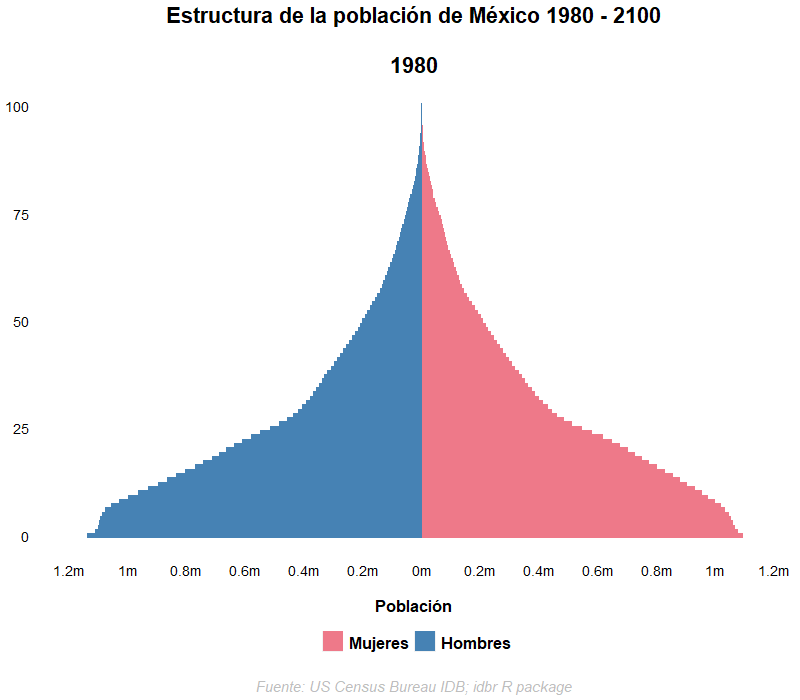

# Mexico_Population_Pyramid_Animation
### Creación de una pirámide poblacional para México en R con datos del United States Census

Los datos de la población de México fueron adquiridos a partir del [idbr package for R](https://github.com/walkerke/idbr), que permite el acceso a indicadores demográficos del [United States Census: International Database (IDB)](https://www.census.gov/data/developers/data-sets/international-database.html) y descargarlos en formato de datasets en R. En el caso de México, los datos de población están disponibles desde 1980 a 2100 (proyectado). 

<h>

